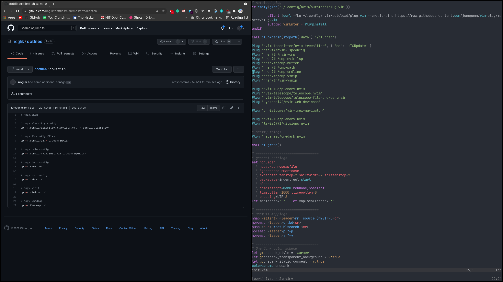

# Config files

This is configurations for usefull applications

## Application list
- zsh/oh-my-zsh
- nvim
- alacritty
- i3-gaps
- node/npm

## Nvim lsp
Install language servers:
```
npm install -g typescript typescript-language-server vscode-langservers-extracted vim-language-server
```


